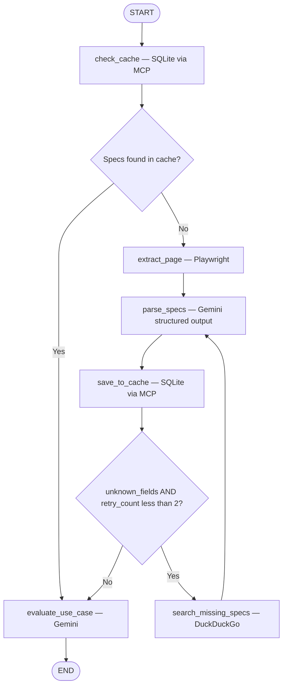
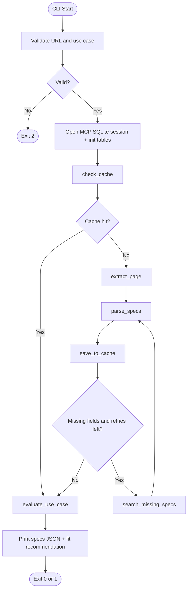

# Laptop Spec Agent

A LangGraph agent that extracts structured laptop hardware specifications from retail product pages. It checks a **SQLite cache** (via MCP) for known laptops, scrapes with Playwright when needed, parses specs with Google Gemini, fills gaps with DuckDuckGo search, persists results for **cross-retailer identity aliasing**, and evaluates fit against your use case.

## What it does

Given a product URL (e.g. Lenovo, Dell, HP), the agent:

1. **Checks cache** — looks up the URL, then a fast MPN/SKU extracted from the URL, in SQLite (`url_mapping` / `mpn_mapping`).
2. **On cache hit** — loads cached specs and skips scraping; goes straight to fit evaluation.
3. **On cache miss** — **scrapes** visible page text with headless Chromium.
4. **Extracts** specs into a strict Pydantic schema via Gemini structured output (including weight, screen size, battery Wh, OS, GPU type).
5. **Saves to cache** — writes the `laptops` row plus URL and MPN alias rows.
6. **Validates** which fields are still missing (`unknown_fields`).
7. **Searches** the web for missing fields (up to 2 retry rounds) and re-parses enriched content.
8. **Evaluates fit** against your stated use case (recommended / not recommended / compromise / insufficient data).

Output is laptop specs JSON plus a use-case fit evaluation. Repeat visits to the same product (or the same MPN on another retailer) can reuse cached specs.

### Extracted fields

| Field | Type | Description |
|-------|------|-------------|
| `model_name` | string | Product / model name |
| `processor_architecture` | string | CPU architecture (x86-64, ARM64, hybrid, etc.) |
| `npu_tops` | number | NPU performance in TOPS |
| `display_panel_type` | string | Panel tech (IPS, OLED, Mini-LED, …) |
| `tdp_watts` | number | Thermal design power (watts) |
| `gan_charging_support` | boolean | GaN fast charging supported or included |
| `refresh_rate_hz` | integer | Display refresh rate (Hz) |
| `weight_kg` | number | Laptop weight (kg) |
| `screen_size_inches` | number | Diagonal screen size (inches) |
| `battery_capacity_wh` | integer | Battery capacity (Wh) |
| `operating_system` | string | Preinstalled OS |
| `gpu_type` | string | `dedicated`, `integrated`, or `hybrid` |
| `slug_id` | string | Stable cross-retailer identity key (set at extract time) |
| `part_number_mpn` | string | Manufacturer part number / SKU when known |

Fields not found on the page or in search results remain `null`. The CLI may exit successfully with a **partial** result and log which fields are still missing. Identity fields (`slug_id`, `part_number_mpn`) do not count toward `unknown_fields` for the search loop.

## Architecture

### LangGraph flow (agent nodes)

> **Preview in Cursor / VS Code:** install [Markdown Preview Mermaid Support](https://marketplace.visualstudio.com/items?itemName=bierner.markdown-mermaid) to render diagrams locally. **GitHub** renders Mermaid on github.com. Paste blocks into [mermaid.live](https://mermaid.live) if needed.



Each run opens an MCP stdio session to **`mcp-server-sqlite`** (default: `uvx mcp-server-sqlite --db-path data/laptop_cache.db`). Cache lookup failures are non-fatal: the agent falls back to scraping.

### End-to-end flow (CLI + graph)



The search loop runs at most **twice** (`retry_count` 0 → 1 → 2). After `parse_specs` on the scrape path, specs are written to cache before the retry decision. Cache hits **skip** Playwright, parsing, search, and save.

### SQLite cache (cross-retailer aliasing)

| Table | Purpose |
|-------|---------|
| `laptops` | One row per `slug_id` with hardware specs + `unknown_fields_json` |
| `url_mapping` | Product page URL → `slug_id` |
| `mpn_mapping` | Manufacturer part number / SKU → `slug_id` |

`check_cache` resolves identity in order: **URL** → **MPN extracted from URL** → load **`laptops`** by `slug_id`. `save_to_cache` uses `INSERT OR REPLACE` on `laptops` and `INSERT OR IGNORE` on alias tables.

Default database file: `data/laptop_cache.db` (gitignored). Delete this file if you change the schema and need a fresh empty database.

### Project layout

| File / directory | Role |
|------------------|------|
| `graph.py` | LangGraph nodes (`check_cache`, scrape, parse, `save_to_cache`, search, fit), CLI, streaming |
| `mcp_client.py` | MCP SQLite session, schema init, cache read/write SQL |
| `mpn.py` | Fast MPN/SKU extraction from product URLs |
| `prompts/` | LLM prompt templates (`spec_extraction`, `use_case_fit`) |
| `schema.py` | `LaptopSpecs` and `UseCaseFitEvaluation` Pydantic models |
| `state.py` | `AgentState` TypedDict |
| `tools.py` | Async Playwright scrape + DuckDuckGo search tools |
| `llm_config.py` | Gemini client + structured output |
| `errors.py` | Typed errors and user-facing messages |
| `logging_config.py` | Console + `logs/system.log` loggers |
| `data/` | SQLite cache directory (`laptop_cache.db` created at runtime) |
| `.env` | Secrets (not committed; see `.env.example`) |

### Tech stack

- **Python 3.12+** (managed with [uv](https://github.com/astral-sh/uv))
- **LangGraph** — stateful graph with cache routing and conditional search retries
- **MCP** (`mcp` + `mcp-server-sqlite` via `uvx`) — SQLite cache over stdio
- **Playwright** — async page rendering
- **langchain-google-genai** — Gemini with `with_structured_output(LaptopSpecs)`
- **langchain-community** — DuckDuckGo search (`DuckDuckGoSearchRun` / `ddgs`)
- **Pydantic** — schema validation

## Quick start (new users)

Full step-by-step setup (verify install, pip alternative, troubleshooting): **[docs/SETUP.md](docs/SETUP.md)**

1. Clone the repo and `cd laptop-spec-agent`
2. `uv sync` (or pip + venv — see SETUP guide)
3. `uv run playwright install chromium`
4. `cp .env.example .env` and set `GOOGLE_API_KEY` from [Google AI Studio](https://aistudio.google.com/apikey)
5. `uv run python graph.py "https://your-product-page-url"` (you will be prompted for a short use case, max 25 words)

## Prerequisites

- Python 3.12+
- [uv](https://github.com/astral-sh/uv) (recommended) or pip
- A [Google AI Studio API key](https://aistudio.google.com/apikey) for Gemini

## Installation

```bash
git clone <your-repo-url>
cd laptop-spec-agent

uv sync
uv run playwright install chromium
cp .env.example .env
# Edit .env: GOOGLE_API_KEY=your_key_here
```

Verify everything is wired up:

```bash
uv run python -c "from graph import build_graph; build_graph(); print('Ready')"
```

## Usage

Run the agent with a product page URL. After the URL is validated, you are prompted for a **use case** (natural language, **25 words maximum**), unless you pass `--use-case`:

```bash
uv run python graph.py "https://www.example.com/laptop-product-page"
# Prompt: Describe your laptop use case in 25 words or fewer...

uv run python graph.py "https://www.example.com/laptop" --use-case "Computer science studies, light coding, long battery, under 1.4kg"
```

Successful runs print **laptop specs JSON** and a **fit evaluation** (recommendation + rationale). Progress streams to the console; details go to `logs/system.log`.

### Fit recommendations

| Value | Meaning |
|-------|---------|
| `recommended` | Strong fit for the stated use case |
| `not_recommended` | Poor fit; important needs likely unmet |
| `compromise` | Acceptable with clear tradeoffs |
| `insufficient_data` | Too many unknown specs to judge fairly |

### Example output

```json
{
  "model_name": "ThinkPad X1 Carbon Gen 13",
  "processor_architecture": "Intel Core Ultra (Lunar Lake)",
  "npu_tops": 13.0,
  "display_panel_type": "OLED",
  "tdp_watts": null,
  "gan_charging_support": true,
  "refresh_rate_hz": 120,
  "weight_kg": 1.12,
  "screen_size_inches": 14.0,
  "battery_capacity_wh": 57,
  "operating_system": "Windows 11 Pro",
  "gpu_type": "integrated",
  "slug_id": "thinkpad-x1-carbon-gen-13",
  "part_number_mpn": "21NXCTO1WWUS1"
}
```

### Exit codes

| Code | Meaning |
|------|---------|
| `0` | Specs extracted (may still have null fields — see warnings) |
| `1` | Runtime failure (scrape, LLM, fatal agent error) |
| `2` | Invalid CLI input (bad URL) |
| `130` | Interrupted (Ctrl+C) |

Errors are printed to stderr as `Error: <message>` with actionable hints when possible.

### Programmatic use

```python
import asyncio
from graph import run_agent, stream_agent

async def main():
    url = "https://www.example.com/laptop"
    use_case = "Video editing and 4K playback on the go"

    result = await run_agent(url, use_case)
    print(result.get("specs"))
    print(result.get("fit_evaluation"))

    async for status in stream_agent(url, use_case):
        print(status["message"])

asyncio.run(main())
```

## Configuration

Environment variables (`.env` or shell):

| Variable | Required | Default | Description |
|----------|----------|---------|-------------|
| `GOOGLE_API_KEY` | Yes* | — | Gemini API key (`GEMINI_API_KEY` also accepted) |
| `GEMINI_MODEL` | No | `gemini-2.5-flash` | Gemini model id |
| `PLAYWRIGHT_TIMEOUT_MS` | No | `60000` | Page load timeout (ms) |
| `PLAYWRIGHT_WAIT_UNTIL` | No | `domcontentloaded` | Playwright `wait_until` (`load`, `networkidle`, …) |
| `LOG_LEVEL` | No | `DEBUG` | System log verbosity (`logs/system.log`) |
| `SQLITE_DB_PATH` | No | `data/laptop_cache.db` | SQLite file for the spec cache |
| `MCP_SQLITE_COMMAND` | No | `uvx` | Executable to launch the MCP SQLite server |
| `MCP_SQLITE_ARGS` | No | `mcp-server-sqlite --db-path <db>` | Arguments for the MCP server (space-separated) |

\*Required before the LLM parse or fit-evaluation steps run.

The cache needs **`uvx`** (or another way to run `mcp-server-sqlite`) on your PATH. If the MCP server cannot start, cache checks are skipped and the agent still scrapes normally.

### Playwright tips

Heavy retail sites often never reach `networkidle`. Defaults use `domcontentloaded` and a 60s timeout. If scrape timeouts persist:

```bash
PLAYWRIGHT_TIMEOUT_MS=90000
PLAYWRIGHT_WAIT_UNTIL=load
```

## How caching works

1. **`check_cache`** — `SELECT slug_id FROM url_mapping WHERE url = ?`; on miss, extract MPN from the URL and query `mpn_mapping`; if a `slug_id` is found, `SELECT * FROM laptops` and set `state["specs"]`.
2. **Cache hit** — graph routes directly to **`evaluate_use_case`** (no Playwright, no Gemini parse, no search).
3. **Cache miss** — full scrape path; after each successful **`parse_specs`**, **`save_to_cache`** persists specs and aliases.
4. **Second retailer** — same MPN or a new URL for the same `slug_id` hits the cache via `mpn_mapping` / `url_mapping`.

## How the retry loop works

After each `parse_specs` node (scrape path only; not re-run on cache hit):

- `LaptopSpecs.unknown_fields` lists null schema fields.
- If any are missing **and** `retry_count < 2`, the graph routes to `search_missing_specs`.
- That node runs one DuckDuckGo query per missing field (e.g. `"Dell XPS 13 NPU TOPS specs"`), appends results to `raw_content`, increments `retry_count`, and loops back to `parse_specs`.
- Per-field search failures are recorded in context but do not stop the loop unless the whole node fails.

## Logging

Two loggers:

| Logger | Output | Audience |
|--------|--------|----------|
| `laptop_spec_agent.user` | Console | High-level progress |
| `laptop_spec_agent.system` | `logs/system.log` (rotating) | Debug traces, stack traces |

Log files are gitignored; the `logs/` directory is kept via `logs/.gitkeep`.

## Streaming status

The graph uses LangGraph `astream` with `stream_mode=["updates", "custom", "values"]`:

- **custom** — fine-grained messages from nodes (`get_stream_writer`), including cache hit/miss
- **updates** — node-level errors, cache loads, parse summaries, fit results
- **values** — full state snapshots for the final result

`run_agent()` wraps `stream_agent()` and returns the final `AgentState`.

## Error handling

Errors are normalized in `errors.py` into typed exceptions (`ScrapeError`, `LLMError`, `SearchError`, etc.) with:

- A clear **user message**
- An optional **hint** (fix API key, install Playwright, increase timeout, …)

Graph nodes store formatted errors in `state["error"]` instead of crashing the process. The CLI maps failures to exit codes and stderr messages.

Common cases:

| Symptom | Likely cause | What to try |
|---------|--------------|-------------|
| Timeout loading page | Slow / heavy site | Raise `PLAYWRIGHT_TIMEOUT_MS`, change `PLAYWRIGHT_WAIT_UNTIL` |
| Empty page content | Bot blocking, JS-only UI | Different URL or manual spec page |
| API key rejected | Invalid / revoked key | Update `GOOGLE_API_KEY` in `.env` |
| Quota / 429 | Rate limits | Wait, or use a lighter `GEMINI_MODEL` |
| Playwright executable missing | Browser not installed | `uv run playwright install chromium` |
| Partial JSON (null fields) | Specs not on page / search missed | Normal after max retries; check warnings |
| Cache always misses | Empty DB or MCP server unavailable | First run populates cache; ensure `uvx` works; see `logs/system.log` |
| Stale / wrong cached specs | Old row for same `slug_id` | Delete `data/laptop_cache.db` and re-run (schema changes require a fresh DB) |

See `logs/system.log` for full stack traces.

## Development

```bash
# Unit tests (no API key, browser, or network required)
uv run pytest

# Smoke import
uv run python -c "from graph import build_graph; build_graph()"

# Help
uv run python graph.py --help
```

### Tests

| File | Covers |
|------|--------|
| `tests/test_errors.py` | URL/use-case validation, exception mapping |
| `tests/test_schema.py` | `LaptopSpecs.unknown_fields`, fit model |
| `tests/test_graph.py` | Routers, search queries, graph node names, status helpers |
| `tests/test_mcp_client.py` | SQL literals, row mapping, insert SQL |
| `tests/test_mpn.py` | MPN extraction from URLs |
| `tests/test_prompts.py` | Prompt builder formatting |


Integration tests (live Playwright, Gemini, DuckDuckGo) are not included so CI stays fast and credential-free.

### Design constraints (`.cursorrules`)

- LangGraph only (no legacy LangChain `AgentExecutor`)
- Explicit `TypedDict` state
- Stateless `@tool` functions
- Async I/O for scrape and search
- Graceful node failures via `state["error"]`

## Security

- **Never commit `.env`** — it is gitignored.
- Rotate API keys if they are exposed in chat or logs.
- The agent only fetches URLs you pass; use trusted product pages.

## License

Add your license here.
