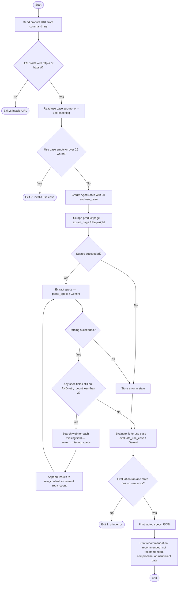

# Laptop Spec Agent

A LangGraph agent that extracts structured laptop hardware specifications from retail product pages. It scrapes the page with Playwright, parses specs with Google Gemini, and optionally fills gaps using DuckDuckGo web search before returning validated JSON.

## What it does

Given a product URL (e.g. Lenovo, Dell, HP), the agent:

1. **Scrapes** visible page text with headless Chromium.
2. **Extracts** specs into a strict Pydantic schema via Gemini structured output.
3. **Validates** which fields are still missing (`unknown_fields`).
4. **Searches** the web for missing fields (up to 2 retry rounds).
5. **Re-parses** enriched content until specs are complete or retries are exhausted.
6. **Evaluates fit** against your stated use case (recommended / not recommended / compromise / insufficient data).

Output is laptop specs JSON plus a use-case fit evaluation.

### Extracted fields

| Field | Type | Description |
|-------|------|-------------|
| `model_name` | string | Product / model name |
| `processor_architecture` | string | CPU architecture (x86-64, ARM64, hybrid, etc.) |
| `npu_tops` | number | NPU performance in TOPS |
| `display_panel_type` | string | Panel tech (IPS, OLED, Mini-LED, …) |
| `tdp_watts` | number | Thermal design power (watts) |
| `gan_charging_support` | boolean | GaN fast charging supported or included |
| `refresh_rate_hz` | integer | Display refresh rate (Hz) |

Fields not found on the page or in search results remain `null`. The CLI may exit successfully with a **partial** result and log which fields are still missing.

## Architecture

### Flowchart

> **Preview in Cursor / VS Code:** the built-in Markdown preview does **not** render Mermaid unless you install an extension (e.g. [Markdown Preview Mermaid Support](https://marketplace.visualstudio.com/items?itemName=bierner.markdown-mermaid)). **GitHub** renders the diagram below automatically when you view this file on github.com. You can also paste the Mermaid block into [mermaid.live](https://mermaid.live).



Rectangles are processing steps, diamonds are decisions, and rounded terminals are start/end. The search loop runs at most twice (`retry_count` 0 → 1 → 2). After retrieval finishes or fails, control always reaches **Evaluate fit** before exit.

**Plain-text version** (visible in any Markdown preview):

```
                              ┌─────────┐
                              │  Start  │
                              └────┬────┘
                                   ▼
                    ┌──────────────────────────────┐
                    │ Read URL from command line   │
                    └──────────────┬───────────────┘
                                   ▼
                         ┌─────────────────┐
                    No   │ Valid http(s)   │ Yes
              ┌──────────│     URL?        │──────────┐
              ▼          └─────────────────┘          ▼
        ┌──────────┐                         ┌─────────────────┐
        │ Exit (2) │                         │ Read use case   │
        └──────────┘                         │ (≤ 25 words)    │
                                             └────────┬────────┘
                                                      ▼
                                            ┌─────────────────┐
                                            │ Init AgentState │
                                            └────────┬────────┘
                                                     ▼
                                            ┌─────────────────┐
                                            │ Scrape page     │
                                            │ (Playwright)    │
                                            └────────┬────────┘
                                                     ▼
                                              ┌─────────────┐
                                         No   │ Scrape OK?  │ Yes
                                    ┌─────────│             │─────────┐
                                    ▼         └─────────────┘         ▼
                              ┌──────────┐                  ┌─────────────────┐
                              │Set error │                  │ Parse specs     │
                              └────┬─────┘                  │ (Gemini)        │
                                   │                        └────────┬────────┘
                                   │                                 ▼
                                   │                          ┌─────────────┐
                                   │                     No   │ Parse OK?   │ Yes
                                   │                ┌─────────│             │─────────┐
                                   │                ▼         └─────────────┘         ▼
                                   │          ┌──────────┐              ┌──────────────────────┐
                                   │          │Set error │         No   │ Missing fields AND   │ Yes
                                   │          └────┬─────┘    ┌───────│ retry_count < 2 ?    │───────┐
                                   │               │          │       └──────────────────────┘       │
                                   │               │          ▼                                      ▼
                                   │               │    ┌─────────────┐                    ┌──────────────┐
                                   │               │    │Search missing│                    │ Evaluate fit │
                                   │               │    │fields (DDG)  │                    │ (Gemini)     │
                                   │               │    └──────┬──────┘                    └──────┬───────┘
                                   │               │           │                                   │
                                   │               │           └──────────► Parse specs ◄────────┘
                                   │               │                      (loop, max 2 retries)
                                   │               └──────────────────────────┤
                                   │                                          ▼
                                   │                                   ┌──────────────┐
                                   │                                   │ Print specs  │
                                   │                                   │ + fit result │
                                   │                                   └──────┬───────┘
                                   │                                          ▼
                                   │                                   ┌──────────────┐
                                   └──────────────────────────────────►│     End      │
                                                                       └──────────────┘
```

### Project layout

| File | Role |
|------|------|
| `graph.py` | LangGraph workflow, CLI, streaming status |
| `schema.py` | `LaptopSpecs` Pydantic model |
| `state.py` | `AgentState` TypedDict |
| `tools.py` | Async Playwright scrape + DuckDuckGo search tools |
| `llm_config.py` | Gemini client + structured output |
| `errors.py` | Typed errors and user-facing messages |
| `logging_config.py` | Console + `logs/system.log` loggers |
| `.env` | Secrets (not committed; see `.env.example`) |

### Tech stack

- **Python 3.12+** (managed with [uv](https://github.com/astral-sh/uv))
- **LangGraph** — stateful graph with conditional retry routing
- **Playwright** — async page rendering
- **langchain-google-genai** — Gemini with `with_structured_output(LaptopSpecs)`
- **langchain-community** — DuckDuckGo search (`DuckDuckGoSearchRun` / `ddgs`)
- **Pydantic** — schema validation

## Quick start (new users)

Full step-by-step setup (verify install, pip alternative, troubleshooting): **[docs/SETUP.md](docs/SETUP.md)**

1. Clone the repo and `cd laptop-spec-agent`
2. `uv sync` (or pip + venv — see SETUP guide)
3. `uv run playwright install chromium`
4. `cp .env.example .env` and set `GOOGLE_API_KEY` from [Google AI Studio](https://aistudio.google.com/apikey)
5. `uv run python graph.py "https://your-product-page-url"` (you will be prompted for a short use case, max 25 words)

## Prerequisites

- Python 3.12+
- [uv](https://github.com/astral-sh/uv) (recommended) or pip
- A [Google AI Studio API key](https://aistudio.google.com/apikey) for Gemini

## Installation

```bash
git clone <your-repo-url>
cd laptop-spec-agent

uv sync
uv run playwright install chromium
cp .env.example .env
# Edit .env: GOOGLE_API_KEY=your_key_here
```

Verify everything is wired up:

```bash
uv run python -c "from graph import build_graph; build_graph(); print('Ready')"
```

## Usage

Run the agent with a product page URL. After the URL is validated, you are prompted for a **use case** (natural language, **25 words maximum**), unless you pass `--use-case`:

```bash
uv run python graph.py "https://www.example.com/laptop-product-page"
# Prompt: Describe your laptop use case in 25 words or fewer...

uv run python graph.py "https://www.example.com/laptop" --use-case "Computer science studies, light coding, long battery, under 1.4kg"
```

Successful runs print **laptop specs JSON** and a **fit evaluation** (recommendation + rationale). Progress streams to the console; details go to `logs/system.log`.

### Fit recommendations

| Value | Meaning |
|-------|---------|
| `recommended` | Strong fit for the stated use case |
| `not_recommended` | Poor fit; important needs likely unmet |
| `compromise` | Acceptable with clear tradeoffs |
| `insufficient_data` | Too many unknown specs to judge fairly |

### Example output

```json
{
  "model_name": "ThinkPad X1 Carbon Gen 13",
  "processor_architecture": "Intel Core Ultra (Lunar Lake)",
  "npu_tops": 13.0,
  "display_panel_type": "OLED",
  "tdp_watts": null,
  "gan_charging_support": true,
  "refresh_rate_hz": 120
}
```

### Exit codes

| Code | Meaning |
|------|---------|
| `0` | Specs extracted (may still have null fields — see warnings) |
| `1` | Runtime failure (scrape, LLM, fatal agent error) |
| `2` | Invalid CLI input (bad URL) |
| `130` | Interrupted (Ctrl+C) |

Errors are printed to stderr as `Error: <message>` with actionable hints when possible.

### Programmatic use

```python
import asyncio
from graph import run_agent, stream_agent

async def main():
    url = "https://www.example.com/laptop"
    use_case = "Video editing and 4K playback on the go"

    result = await run_agent(url, use_case)
    print(result.get("specs"))
    print(result.get("fit_evaluation"))

    async for status in stream_agent(url, use_case):
        print(status["message"])

asyncio.run(main())
```

## Configuration

Environment variables (`.env` or shell):

| Variable | Required | Default | Description |
|----------|----------|---------|-------------|
| `GOOGLE_API_KEY` | Yes* | — | Gemini API key (`GEMINI_API_KEY` also accepted) |
| `GEMINI_MODEL` | No | `gemini-2.5-flash` | Gemini model id |
| `PLAYWRIGHT_TIMEOUT_MS` | No | `60000` | Page load timeout (ms) |
| `PLAYWRIGHT_WAIT_UNTIL` | No | `domcontentloaded` | Playwright `wait_until` (`load`, `networkidle`, …) |
| `LOG_LEVEL` | No | `DEBUG` | System log verbosity (`logs/system.log`) |

\*Required before the LLM parse step runs.

### Playwright tips

Heavy retail sites often never reach `networkidle`. Defaults use `domcontentloaded` and a 60s timeout. If scrape timeouts persist:

```bash
PLAYWRIGHT_TIMEOUT_MS=90000
PLAYWRIGHT_WAIT_UNTIL=load
```

## How the retry loop works

After each `parse_specs` node:

- `LaptopSpecs.unknown_fields` lists null schema fields.
- If any are missing **and** `retry_count < 2`, the graph routes to `search_missing_specs`.
- That node runs one DuckDuckGo query per missing field (e.g. `"Dell XPS 13 NPU TOPS specs"`), appends results to `raw_content`, increments `retry_count`, and loops back to `parse_specs`.
- Per-field search failures are recorded in context but do not stop the loop unless the whole node fails.

## Logging

Two loggers:

| Logger | Output | Audience |
|--------|--------|----------|
| `laptop_spec_agent.user` | Console | High-level progress |
| `laptop_spec_agent.system` | `logs/system.log` (rotating) | Debug traces, stack traces |

Log files are gitignored; the `logs/` directory is kept via `logs/.gitkeep`.

## Streaming status

The graph uses LangGraph `astream` with `stream_mode=["updates", "custom", "values"]`:

- **custom** — fine-grained messages from nodes (`get_stream_writer`)
- **updates** — node-level errors and parse summaries
- **values** — full state snapshots for the final result

`run_agent()` wraps `stream_agent()` and returns the final `AgentState`.

## Error handling

Errors are normalized in `errors.py` into typed exceptions (`ScrapeError`, `LLMError`, `SearchError`, etc.) with:

- A clear **user message**
- An optional **hint** (fix API key, install Playwright, increase timeout, …)

Graph nodes store formatted errors in `state["error"]` instead of crashing the process. The CLI maps failures to exit codes and stderr messages.

Common cases:

| Symptom | Likely cause | What to try |
|---------|--------------|-------------|
| Timeout loading page | Slow / heavy site | Raise `PLAYWRIGHT_TIMEOUT_MS`, change `PLAYWRIGHT_WAIT_UNTIL` |
| Empty page content | Bot blocking, JS-only UI | Different URL or manual spec page |
| API key rejected | Invalid / revoked key | Update `GOOGLE_API_KEY` in `.env` |
| Quota / 429 | Rate limits | Wait, or use a lighter `GEMINI_MODEL` |
| Playwright executable missing | Browser not installed | `uv run playwright install chromium` |
| Partial JSON (null fields) | Specs not on page / search missed | Normal after max retries; check warnings |

See `logs/system.log` for full stack traces.

## Development

```bash
# Run tests / smoke import
uv run python -c "from graph import build_graph; build_graph()"

# Help
uv run python graph.py --help
```

### Design constraints (`.cursorrules`)

- LangGraph only (no legacy LangChain `AgentExecutor`)
- Explicit `TypedDict` state
- Stateless `@tool` functions
- Async I/O for scrape and search
- Graceful node failures via `state["error"]`

## Security

- **Never commit `.env`** — it is gitignored.
- Rotate API keys if they are exposed in chat or logs.
- The agent only fetches URLs you pass; use trusted product pages.

## License

Add your license here.
